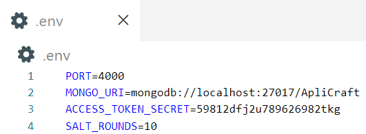

# Backend

Full backend for the app.

Specify TODO in TODO.md

## How to setup

1. **Prerequisites:**

   - [](https://git-scm.com/downloads)
     - used version: `2.43.0.windows.1`
   - [](https://nodejs.org/en/download/prebuilt-installer) [](https://nodejs.org/en/download/prebuilt-installer)
     - node used version: `v20.2.0`
     - npm used version: `9.6.6`
   - [](https://mongodb.com)
     - used version: `7.0`

2. **[Create git to github ssh key](https://docs.github.com/en/authentication/connecting-to-github-with-ssh/adding-a-new-ssh-key-to-your-github-account).**
3. **Clone repo:**

   ```powershell|terminal|shell
   git clone https://github.com/ApliCraft/Backend
   ```

4. **cd into repo and install needed packages:**

   ```powershell|terminal|shell
   cd Backend
   npm i
   ```

5. **(optional)** Create .env file with

   `PORT=[website port]`

   `MONGO_URI=[mongodb url with db name example: (mongodb://localhost:27017/ApliCraft)]`

   

6. **Run the app/build/run** as development environment:

   ```powershell|terminal|shell
    npm start
    npm run build
    npm run dev
   ```
